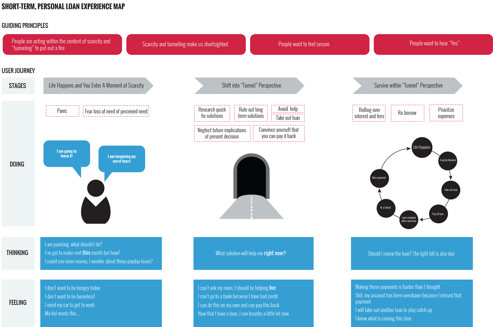

{::options parse_block_html="true" /}

<!--Jennings ugly css in page is better than inline, eh, right?-->

<section id="summary">

## Executive Summary

Code for America is a San Francisco based non-profit that believes government can work for t people, by the people in the 21st century. Code for America works with cities to build open source technology and organize a network of people dedicated to making government services simple, effective, and easy to use.

The Fellowship program sends teams of experienced technologists into local governments across the country to work full-time for a year in partnership with government officials. The fellows apply 21st Century Government Principles to important problems.

In conjunction, the team is excited to work with leaders in city hall and the community to find new solutions to old problems. We are passionate about doing, not just thinking and will work to always keep our work open and transparent through regularly publishing our work and findings online, holding discussions and co-design session with both community and city partners, and aligning our principles and themes with clear input and validation from experts not only in subject matter but proximity.

</section>

<section id="objectives">

## Objectives
    
As New Mexico’s largest city, the City of Albuquerque is working to increase opportunities for economic development and social mobility for all residents. Code for America has partnered with the Albuquerque Mayor’s Office to research and build interventions addressing the barriers that residents face in accessing critical information, services, and employment opportunities. The Code for America fellows will test and develop a technology solution that facilitates upward mobility for Albuquerque residents. The overall goal — as outlined by the city — is to “enhance the upward mobility of residents by focusing on economic development initiatives.”
    
To help us understand what that means in digestible terms — here are some points from our initial brief:
    
* Make more people "employable"
* Remove barriers to information about jobs, job opportunities, employer incentives
* Create pathways from family services to skills for employment to access to jobs
* Surface and identify 'soft skills and services' to enable people to look for work (daycare, nice clothes, etc).

### How will this affect the City of Albuquerque?
	
There are two types of defined outcomes, *Primary* and *Organizational*.
	
#### Primary Outcomes

The largest is to connect the dots and standardize some of the communications and data being shared between the city and its residents around economic development departments, initiatives, and community partners. The city would also like to see the fellows ‘refresh’ some of the technology now used for skills based hiring. This includes hiring within city hall. Another key objective is to improve access to talent for small businesses moving to or operating out of the metro area.

#### Organization Outcomes
	
The first thing we heard from our city partner when we stepped foot in City Hall is to be ‘catalyst for change!’ No kidding, by the brief it states: “make stakeholders see that change is possible and inexpensive.” Another objective is to grow the civic tech community and improve sustainability for new services. Lastly, to scale up data opportunities and allow the city to become, as Mayor Berry so simply put it:

<h2 class="quote">“information rich, instead of simply data rich.”</h2>

</section>

<section id="opportunity">

## The Opportunity

### Overview of Hardship: Underserved and Underutilized

We traveled to Albuquerque in February to discover how we could use technology to  create more opportunities for upward mobility for residents. During our February residency, we spoke with individuals at every level of the community, ranging from top city officials in the Mayor’s Office to everyday independent business owners and residents.

<h2 class="quote">70% of the state of New Mexico is working poor</h2>

Through our research, we learned a shocking fact: that 70% of the state of New Mexico is working poor. Working poor is defined as residents who receive at least one social service and who who fall below some percentage of the poverty level. Through further research, we learned that the poverty rate in Albuquerque has steadily increased over the past 7 years, affecting youth 18-24 years old and children under 5 years old the most. It’s predicted that almost 1/5th of the residents are living below the poverty line. It is even worse for children, 29% of whom are believed to live in poverty. 

Over the past few months, we’ve had the opportunity to get to know many Burquenos experiencing this degree of hardship. 

Through our research, we learned that in addition to low educational attainment and limited workforce skills, the key factor preventing residents in hardship from advancing in their careers and up the socioeconomic ladder is social isolation. This isolation is especially acute when suddenly, “life happens.” Whether a resident loses a job or encounters a surprise financial bump in the road, they are ordinarily dealing with it by themselves. Most importantly, when facing a significant challenge, one’s feeling of isolation often leads to mental fatigue, feeling optionless,  and a subsequent series of hasty, costly and regrettable decisions. 

Helping residents in need find and understand the entire spectrum of options both by type of need and the time it will take to get assistance can have a major impact in their life. 

> Helping residents in need find and understand the entire **spectrum** of options both by **type** of need and the **time** it will take to get assistance can have a major impact in their life.

</section>

<section id="approach">

## Our Approach

We’ve been asking ourselves:

> How might we help people in need understand all of their options in time? 

We’re designing TiaSabia, a web platform that helps residents in financial need find and understand the entire spectrum both by **type** of need and the **time** it will take to get the assistance they need.

TiaSabia will help residents in hardship by giving them a wider perspective of available options, help them creatively strategize solutions, and help them think ahead and understand the future implications of their present choices. To guide us through our development process, we have established three key design principles.

### Design for Self-Reliance

Through the TiaSabia experience, we hope to create a space of possibility and agency. We want to design for positive emotions such as self-reliance and persistence. We want to enable users who might be mentally fatigued due to their hardship to feel like they can actively change, and take full control of their lives.

### Encourage a Positive Narrative

Despite having a history of negative representation in the media, residents see an opportunity to positively enhance Albuquerque’s narrative. As one resident put it, “we are not good at telling our own story.” Through conversations with the community it became clear that negative opinions about Albuquerque have found their way into the minds of many residents. Both from large, external sources like The New Yorker and Rolling Stone (who both profiled the city’s police departments in the last year) to small local news sources focusing their attention on anything with dram,  drugs or violence. 

<h2 class="quote">“We are not good at telling our own story.”</h2>

There is an opportunity to help grow residents’ confidence in themselves and in Albuquerque as a unique place to live. Our goal is to draw out and amplify the already existing positive narrative. 

We will deploy a positive narrative in our work. Meaning that all the elements of our work — from color to fonts, to graphic design and all the way to story, framing, and thesis — will be chosen deliberately with a positive underlying tone. Through doing this we hope our work will support the initiatives that are already successfully operating in this space. 

We’ve failed if our work is not aligned with the positive messages that the city is trying to embrace. We’ll work with residents constantly to keep our narratives grounded in the community’s voice.

### Recognize Multiculturalism

The City of Albuquerque is home not only to a vast and colorful landscape but also to a unique and richly textured community that  continues to capture imaginations. Multiculturalism requires that we be conscious of the cultural diversity within the city as we create products and services. It is important that we understand and leverage the diverse cultural perspectives and local capacity already existing within the community.  As University of New Mexico professor laureate and director of the film and digital media program Miguel Gandert told us, “multiculturalism means that various cultures in a society merit equal respect.” Gandert’s words inspire us to use the most inclusive language in our work and align with the already existing community building progress around tough social issues.

We believe that being culturally grounded and inclusive will help us identify a diversity of champions with whom we can partner in specific focus areas. 

</section>

<section>
## TiaSabia Use Case

<figure markdown="0">
	
</figure>

</section>

<section id="research">

### Research

One of the most significant insights from our research was that many Albuquerque residents in hardship lack the requisite slack or abundance to deal with the shocks of the world. Without any leeway, suddenly losing a job and having to find the funds to pay for retraining creates instability that can have a debilitating impact on one’s life. At that moment of instability, residents tunnel their thinking, and search for the nearest and often problematic solution to their most immediate problem. 

From our conversations with residents who borrowed from high interest lenders, we learned that many are continually one step behind, always playing catchup. We see an opportunity to begin designing solutions for buffering against these sudden shocks. 

### Meet Yvonne

She is a 57 year old part-time chef and student living on $12K a year. Faced with student loans, other bills, and only a part-time income, she needed to do something fast to make ends meet. 

Because she was too embarrassed and stressed to ask her family for help, and thought that a bank loan would take too long or she didn’t have good credit, and wasn’t aware of local safer grants that could have helped her, she decided to borrow $300 from a payday lender at a 400%+ APR to cover her expenses. She felt like she had no other options. 

The idea was simple. She’d get cash now and pay it back along with a fee with her next paycheck. It seemed like exactly what she needed, however, “life happened” and when the loan came due the next month, her part-time income didn’t allow her to pay it back so she had to take out another loan. 

Yvonne is still in this debt cycle, 4 months behind on her payments. She owes ~$400 just in fees and sees no way out. 

<figure markdown="0">
	
</figure>

<h2 class="quote" style="padding-top: 15px;">“Life Happens”</h2>

Unfortunately, Yvonne’s story was not unique in our research nor is it unique in the United States. According to a recent Federal Reserve research study, 47% of respondents said they wouldn’t be able to cover a $400 emergency expense or would have to borrow money or sell something.

In Albuquerque, we heard time and time again, that “life happens” and because residents aren’t aware of or don’t have access to the many existing, safe services that could help them in times of need, they feel like high interest loans are their only options. As one resident who felt she had no other options put it, “what are you doing to do? Get loans. That’s what you’re going to do.”

Residents in hardship experience what many behavioral economists and psychologists call  a mental “bandwidth tax,” or a perspective that is debilitated by anxiety and stress around a looming problem, be it coming up with rent this month or the money to fix a broken-down car. Reduced mental bandwidth can create a dangerous and narrow perspective that desperately searches for nearsighted solutions.

<h2 class="quote" style="padding-top: 15px;">“You Have Too Much on Your Mind”</h2>

<section>

###Experience Map for Resident in Hardship 

<figure markdown="0">
	
</figure>

</section>

<section id="prototypes">
##Initial Tía Sabia Product Demo
The initial product focused on creating a Kiva Zip type service where borrowers could ask their local communities for assistance with small-dollar personal loans. Then the local community aspect would be supported by donors. The donations would lead to a dashboard of data to help everyone understand the scope of need and types of needs being aided.

We used the Wufoo platform to quickly stand up a demo to test with users like Yvonne while in Albuquerque in May. We also showed this prototype to users that would be potential donors. Both groups were interested in the idea and found value in the hyper local approach. The borrows especially like the sliders shown below.
	
<figure markdown="0">
	
	<figcaption>Version 1 of Tía Sabia web app</figcaption>
</figure>

##Tía Sabia Prototype

As stated above, Tía Sabia focuses on aligning by <strong>time</strong> and <strong>type of need</strong>. In our prototype we ask the user to define the need first. The needs are shaped from this hierarchy influenced by Maslow's hierarchy, they should be read from bottom to top; most important to less important respectively.

<figure markdown="0">
	
</figure>

####Step One
Imagine Yvonne, she comes to our service and the first question asked of her is to define the depth of her need shown below.

<figure markdown="0">
	
</figure>

####Step Two
From here, Yvonne is shown a list of opportunities for her since she's defined her <strong>type of need</strong> and <strong>timeline</strong>. In additional she's ask some more questions to contextualize her with the system and reveal options that might also help her that are variables. In this case she selects that she is interested in a coach.

<figure markdown="0">
	
</figure>

####Step Three
Lastly, Yvonne is shown a list of availiable options provided through multiple city, state, and non-for-profit services in the area. She'll now know how long the application process usually takes and have a efficient way to apply for multiple services at once. She's also asked which institution she would like to be connected with for coaching.

<figure markdown="0">
	
</figure>
	
##Initial Prototypes

These are prototypes that we showed the community early on to help guide our hypothesis around people operating in isolation.

###Each-One-Teach-One

People are often alone in the job seeking process. What if we could create a community to hold you accountable around finding jobs?

<figure markdown="0">
	
</figure>

###Co-Working Space Seat Finder

We heard that in ABQ there are more open desks available in coworking spaces than there are people to fill them. What if there was a way to find a desk and see who is nearby, what they are creating, and what their skills are?

<figure markdown="0">
	
</figure>

###Independent Workforce Data Collections

It’s predicted that 40% of the workforce will be independent by 2020. If so, then what might it look like if a city collects information about all these workers who are reporting miscellaneous incomes and use it as a feedback loop not only within government but for residents too.

<figure markdown="0">
	
</figure>

</section>

</section>

<section id="nextsteps">

##Next Steps
	
### Find and/or Create the Data

To build TiaSabia, we are currently in the process of compiling all of the key hyper-local financial resources in Albuquerque. We understand that the data does exist, however, it is not in one central place.

### Understand the Process

To streamline access and the application process for many of these services, we need to have a better understanding of the current process of these services. We need to go through them ourselves, and  understand the inputs and outputs to make them work more effectively.

### Build Relationships

We are continually building relationships with city, community partners, and most importantly the residents who are experiencing hardship in Albuquerque.

</section>

<section id="challenges">

## Challenges

The largest challenge in doing any type of fellowship work is not competing and aligning with existing efforts. This has a lot to do with our goal of wanting our project to continue to be used and maintained after we leave. The founder of the CfA Jen Pahlka has recently been preaching “Opps not Apps” which to us means we need to be careful that we are not building stuff without awareness. This specifically relates back to our design principles. Lastly, we want to actually help those who need help the most. This is a big statement, we know, but we’ve made a commitment to our team this year that we want to do something that is bold and replicable, something that will affect many residents in Albuquerque now and in the future.

</section>

<section id="initiatives">

## Initiatives

### Code for Albuquerque Brigade

</section>

<section id="community">

## Community Events

* Feb 12 / Happy Hour hosted by Team Albuquerque
* Feb 19 / Jennings and William speak on KRQE News 13
* Feb 20 / Brunch with Code for Albuquerque
* Apr 22 / Team hosted Research Show, Talk and Tell Presentation to Community
* Feb 25 / Jennings taught STEMulus Center Design Workshop
* Jun 10 / Team Albuquerque presents in San Francisco at BETA
* Jun 15 / Jennings reports at the Living Cities Initiative in Albuquerque
* Jul 11 / William and Jennings host Albuquerque Web Geeks Community Building Workshop

<video width="100%" autoplay controls>
	<source src="images/talkshowandtellvideo.mp4" type="video/mp4">
	<source src="images/talkshowandtellvideo.ogg" type="video/ogg">
</video>

<figure markdown="0">
	
</figure>

<figure markdown="0">
	
</figure>

</section>

<section>

## Press

* [Three Code for America fellows to create new apps for city services](http://www.bizjournals.com/albuquerque/blog/bizventures/2015/02/three-code-for-america-fellows-to-create-new-apps.html)
* [Mayor Berry introduces Code For America fellowship](http://krqe.com/2015/02/19/mayor-berry-introduces-code-for-america-fellowship/)

</section>

<section id="thankyou">

## Thank You
	
While in Albuquerque we found an incredible amount of hospitality from the residents. We were never questioned in our intentions and were always welcomed into many businesses and homes alike. We are immensely grateful to the individuals who helped us gather these initial findings and will continue to offer our support through teaching, hosting, or facilitating the technologies which we are experts in. The team would simply like to say thank you for the openness and willingness to talk with us and participate in this process over the year of 2015.

</section>
